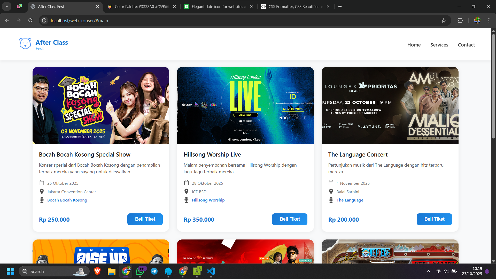
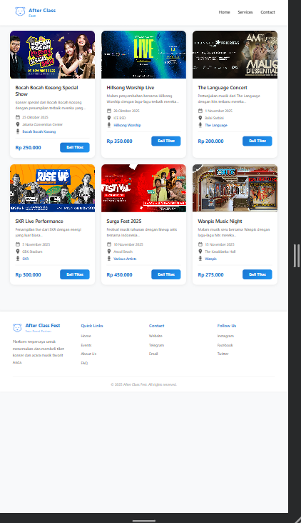

# 🎵 After Class Fest - Event Ticketing Website



---

## 👋 Assalamualaikum Warahmatullahi Wabarakatuh ..

Selamat datang di repository **After Class Fest**! Proyek ini merupakan website platform pembelian tiket konser dan acara musik yang dirancang dengan tampilan modern, minimalis, dan responsive.

---

## 👥 Tim Pengembang

| No | Nama | NIM | Role |
|----|------|-----|------|
| 1 | **Fahmi** | [243200330] | Project Lead & Frontend Developer |
| 2 | **Naura** | [243200332] | UI/UX Designer & Frontend Developer |
| 3 | **Bunga** | [243200333] | Content Manager & Frontend Developer |
| 4 | **Riski Eka** | [243200334] | QA Tester & Frontend Developer |

---

## 📋 Deskripsi Proyek

**After Class Fest** adalah platform berbasis web yang memudahkan pengguna untuk menemukan dan membeli tiket konser serta acara musik favorit mereka. Website ini dibangun dengan fokus pada:

- ✨ **User Experience** yang intuitif dan mudah digunakan
- 🎨 **Design Modern** dengan skema warna putih dan biru yang bersih
- 📱 **Fully Responsive** - kompatibel di semua perangkat
- ⚡ **Performance** yang cepat dan ringan

---

## 🚀 Fitur Utama

### 1. **Event Catalog**
- Menampilkan daftar konser dan acara musik
- Informasi lengkap: tanggal, lokasi, artis, dan harga
- Gambar event dengan aspect ratio 16:9

### 2. **Responsive Design**
- **Desktop**: 3 kolom grid layout
- **Tablet**: 2 kolom grid layout
- **Mobile**: 1 kolom full-width

### 3. **Interactive Elements**
- Hover effects pada kartu event
- Smooth animations
- Button dengan gradient effect

### 4. **Navigation**
- Fixed navbar untuk kemudahan navigasi
- Quick links ke berbagai section
- External links ke Services dan Contact

### 5. **Footer Informatif**
- Quick links navigasi
- Informasi kontak
- Social media links
- Copyright information

---

## 🛠️ Teknologi yang Digunakan

| Teknologi | Versi | Keterangan |
|-----------|-------|------------|
| HTML5 | - | Struktur markup website |
| CSS3 | - | Styling dan layout |
| JavaScript | - | Interaktivitas (optional) |
| Google Fonts | - | Typography |
| Icons8 | - | Icon resources |

---

## 📁 Struktur Folder

```
after-class-fest/
│
├── index.html              # Main HTML file
├── README.md              # Dokumentasi proyek
│
├── assets/
│   ├── css/
│   │   └── style.css      # Stylesheet utama
│   │
│   └── image/
│       ├── bear-logo.png  # Logo website
│       ├── bocah2kosong.png
│       ├── hilsong.jpg
│       ├── languange.jpg
│       ├── skr.jpg
│       ├── surgafest.png
│       └── wanpis.png
│
└── screenshots/           # Screenshot untuk dokumentasi
    ├── desktop-view.png
    └── mobile-view.png
```

---

## 🎨 Color Palette

| Warna | Hex Code | Penggunaan |
|-------|----------|------------|
| Primary Blue | `#1976d2` | Logo, harga, accent |
| Light Blue | `#64b5f6` | Secondary text, hover |
| White | `#ffffff` | Background utama, cards |
| Light Gray | `#f8f9fa` | Body background |
| Dark Gray | `#212121` | Heading text |
| Medium Gray | `#616161` | Body text |

---

## 💻 Cara Instalasi & Penggunaan

### 1. Clone Repository
```bash
git clone https://github.com/FAHMYZAR/web-konser.git
cd web-konser
```

### 2. Buka di Browser
```bash
# Langsung buka file index.html di browser
# Atau gunakan Live Server di VS Code
```

### 3. Edit & Customize
- Edit `index.html` untuk mengubah konten
- Edit `assets/css/style.css` untuk mengubah styling
- Ganti gambar di folder `assets/image/` sesuai kebutuhan

---

## 📱 Responsive Breakpoints

| Device | Breakpoint | Layout |
|--------|-----------|--------|
| Desktop | > 992px | 3 kolom |
| Tablet | 600px - 992px | 2 kolom |
| Mobile | < 600px | 1 kolom |

---

## 🔧 Customization Guide

### Menambah Event Baru
```html
<div class="item">
    
    <div class="item-box">
        <h3>Nama Event</h3>
        <p class="description">Deskripsi event...</p>
        <div class="info">
            <!-- Info items -->
        </div>
        <div class="purchase">
            <div class="price">Rp XXX.XXX</div>
            <button class="btn-buy">Beli Tiket</button>
        </div>
    </div>
</div>
```

### Mengubah Warna Tema
Edit variabel warna di CSS:
```css
/* Primary Blue */
#1976d2 → Ganti dengan warna pilihan Anda

/* Gradient Button */
background: linear-gradient(135deg, #YOUR_COLOR1 0%, #YOUR_COLOR2 100%);
```

---

## 🐛 Known Issues & Future Improvements

### Known Issues
- [ ] Button "Beli Tiket" belum terhubung ke sistem pembayaran
- [ ] Belum ada sistem search/filter event
- [ ] Belum ada halaman detail event

### Future Improvements
- [ ] Integrasi dengan payment gateway
- [ ] Sistem login/register user
- [ ] Fitur search dan filter event
- [ ] Halaman detail event
- [ ] Shopping cart functionality
- [ ] Email confirmation untuk pembelian tiket
- [ ] Admin dashboard untuk manage events

---

## 📸 Screenshots

### Desktop View


### Mobile View


---

## 📝 License

Proyek ini dibuat untuk keperluan edukasi dan pembelajaran.

---

## 🙏 Acknowledgments

- **Icons8** untuk menyediakan icon gratis
- **Google Fonts** untuk typography
- **Anthropic Claude** untuk bantuan development
- **Dosen Pembimbing** atas bimbingannya

---

## 📞 Contact & Support

Untuk pertanyaan, saran, atau kontribusi:

- 🌐 **Website**: [https://icbear.space](https://icbear.space)
- 💬 **Telegram**: [@Bearsszzz](https://t.me/Bearsszzz)
- 📧 **Email**: info@afterclassfest.com

---

## 🌟 Show Your Support

Jika project ini bermanfaat, jangan lupa untuk memberikan ⭐ star pada repository ini!

---

<div align="center">

**Made with ❤️ by After Class Fest Team**

*Semoga bermanfaat dan berkah!*

**Wassalamualaikum Warahmatullahi Wabarakatuh** 🙏

</div>

---

© 2025 After Class Fest. All Rights Reserved.
